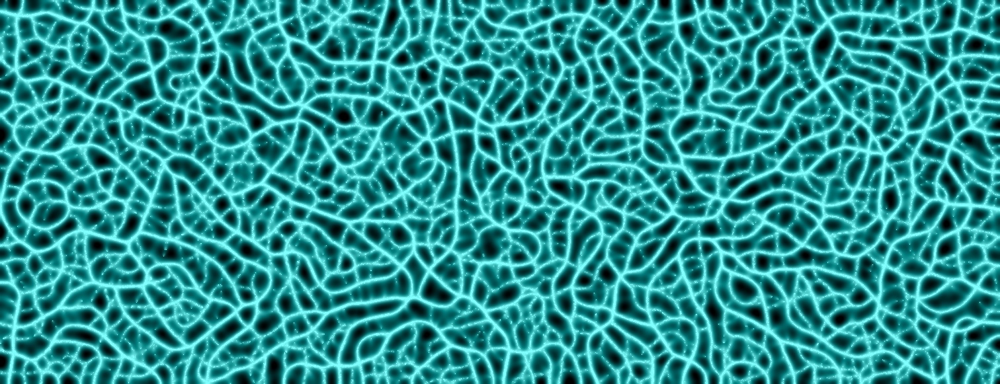
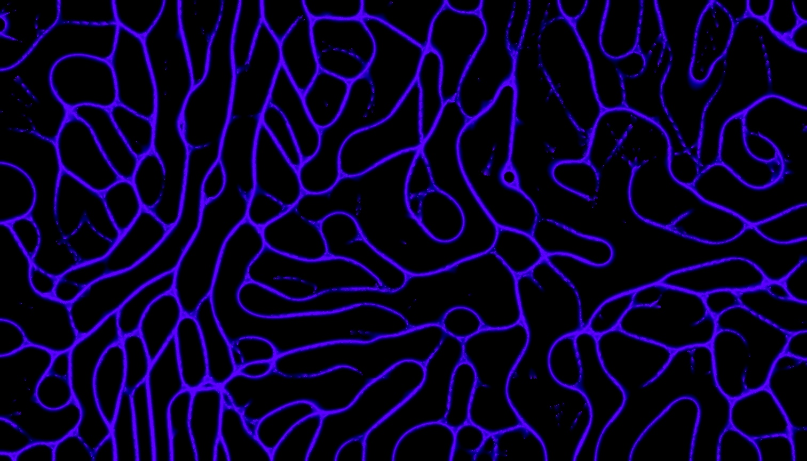

# WebGL-Slime-Simulation

This slime simulation was inspired by [Coding Adventure: Ant and Slime Simulations](https://www.youtube.com/watch?v=X-iSQQgOd1A) whose repository can be found here [Slime-Simulation](https://github.com/SebLague/Slime-Simulation).

This is an implementation of the slime simulation using WebGL which can be played around with at https://baxtercooper.github.io/WebGL-Slime-Simulation/.

